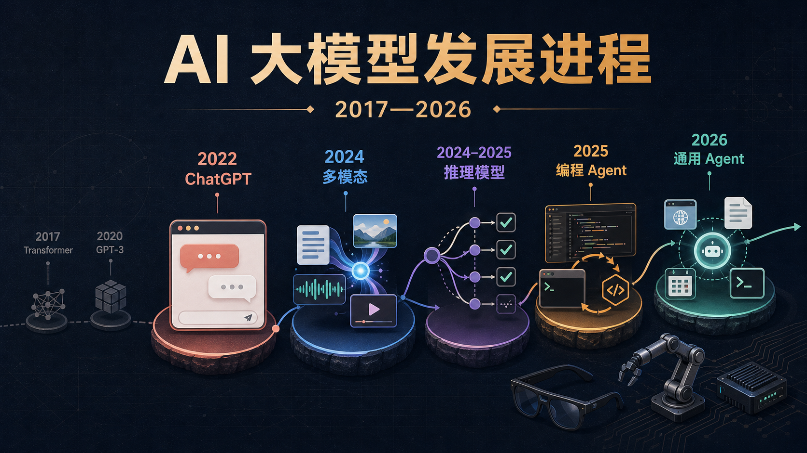
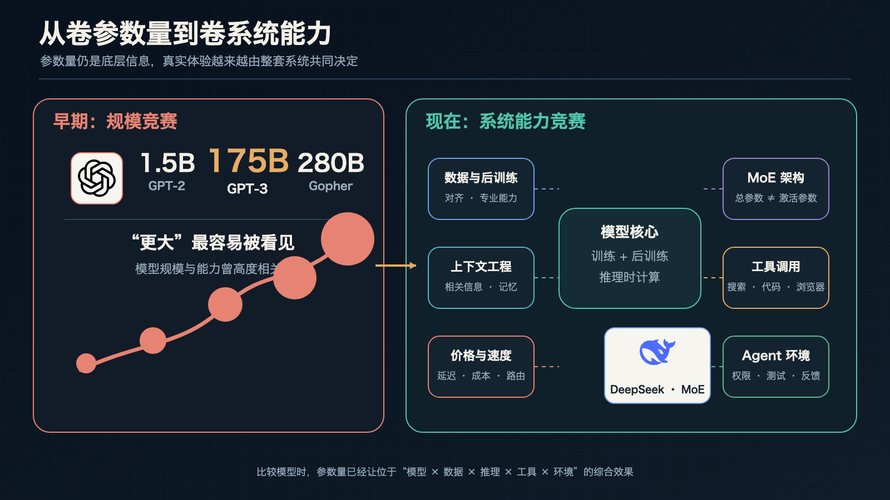
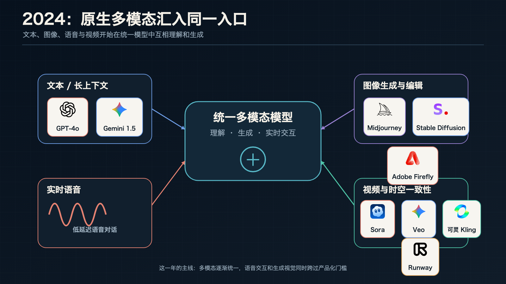
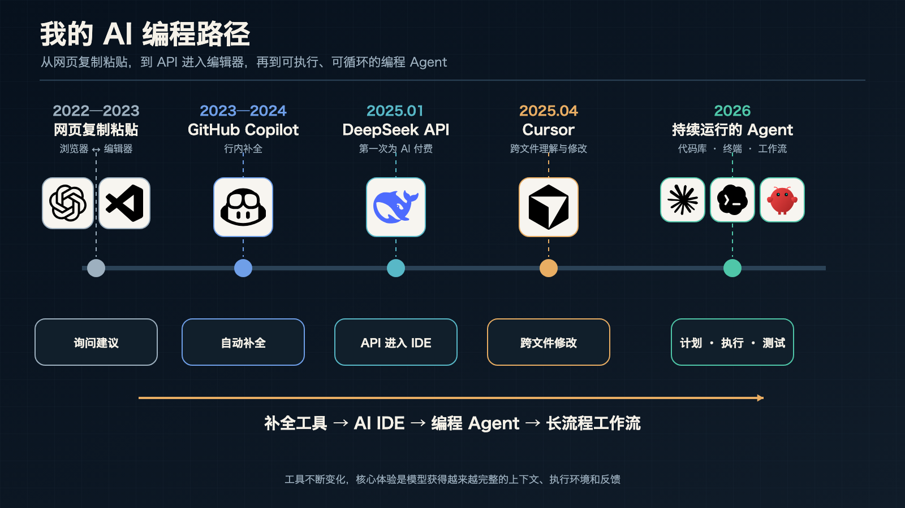
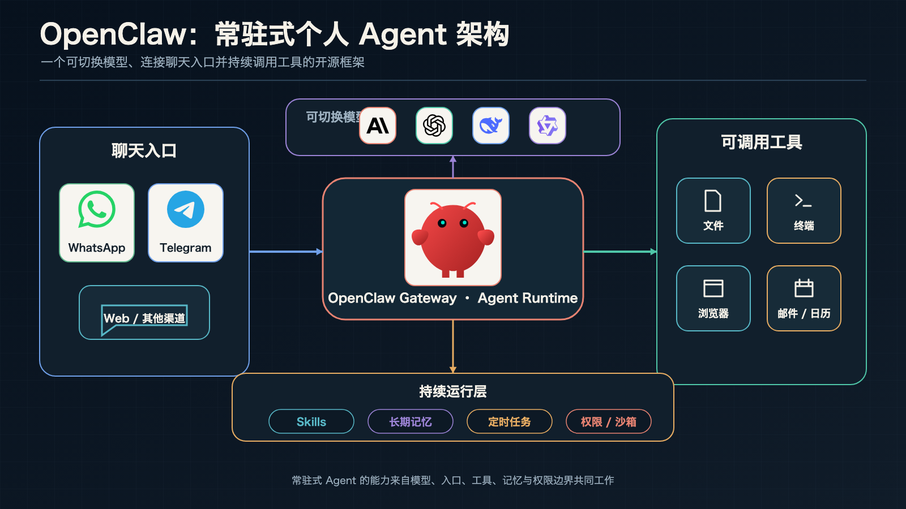
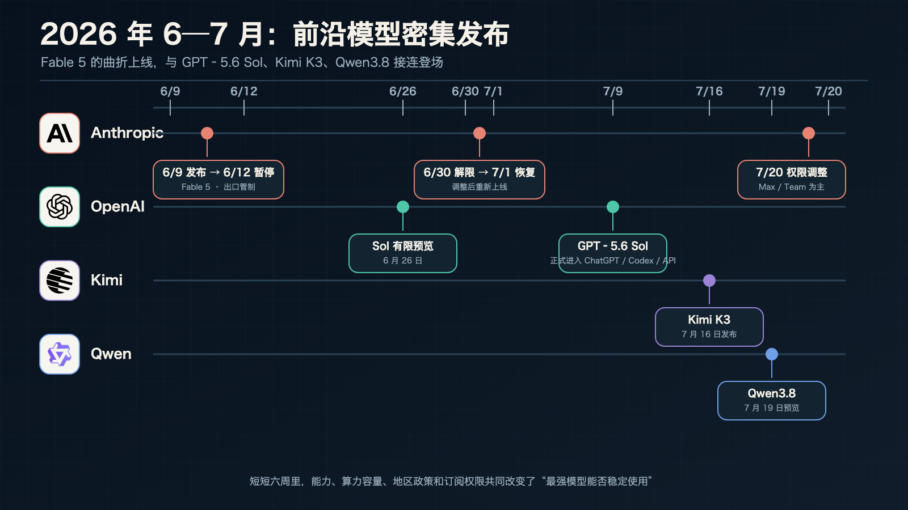
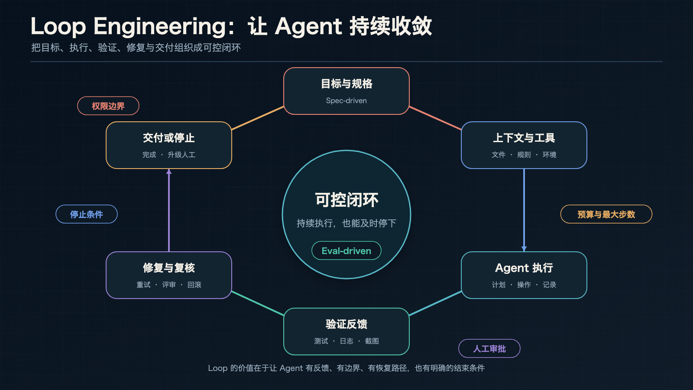

2022 年 11 月，ChatGPT 把大模型装进了一个人人都会用的对话框。不到四年，模型已经进入代码库、浏览器、终端和办公软件，能够读取环境、调用工具、检查结果，再根据反馈继续处理。

模型名称换得很快，真正影响使用方式的变化更稳定：输入从文字扩展到图像和语音，回答前可以投入更多推理，模型也开始拥有执行任务所需的工具与运行环境。

这篇文章沿着这些能力变化，重新梳理从 ChatGPT 到通用 Agent 的发展进程。资料更新至 **2026 年 7 月 31 日**。涉及当前模型与榜单时，我会标明时间和证据边界，避免把厂商自测、单项排名或个人使用感受混成一个结论。

> [!summary]
> 2023 年，大模型通过对话产品进入搜索、办公、写作和编程；2024 年，原生多模态与推理时计算进入主流产品；2025 年，推理模型和编程 Agent 开始进入真实项目；2026 年，竞争继续延伸到长任务、工具协同、验证、权限和交付。
>
> 模型能力仍然重要。一个 Agent 最终能否完成工作，还取决于它看见了什么、拥有什么工具、怎样判断完成，以及出错后能否停下、恢复或回滚。



# 对话框出现之前，大模型已经走了很久

ChatGPT 是大众接触大模型的起点，技术路线的形成要更早。

2017 年，Google 团队发表 [《Attention Is All You Need》](https://research.google/pubs/attention-is-all-you-need/)，提出 Transformer 架构。注意力机制更适合并行训练，也能直接建模序列中相距较远的信息。后来出现的 GPT、BERT、Llama、Gemini、Claude、Qwen 等模型家族，都建立在这条技术路线之上。

2018—2020 年，GPT-1、GPT-2 和 GPT-3 逐步验证了预训练语言模型的扩展能力。GPT-3 使用 1750 亿参数，已经可以在少量示例下完成写作、翻译、问答和代码生成。那时的入口主要面向开发者，普通用户还需要理解 API、参数和提示格式。

模型能生成流畅文字，不代表它会稳定地遵循人的要求。指令微调与人类反馈强化学习把“继续预测文本”调整成“尽量完成用户交给的任务”。OpenAI 在 2022 年公布的 InstructGPT 工作中发现，经过人类偏好对齐的较小模型，也可能比规模大得多的原始 GPT-3 更受人工评价者欢迎。模型是否好用，开始与参数量分开讨论。

参数量后来逐渐淡出发布会，也有更直接的技术原因。[Chinchilla 研究](https://deepmind.google/blog/an-empirical-analysis-of-compute-optimal-large-language-model-training/) 说明，在相近训练计算预算下，模型规模、训练数据量和计算分配需要一起平衡。MoE 又区分了总参数与每次推理实际激活的参数；推理模型则把更多计算放到回答阶段。只看参数量，已经很难解释最终体验。

今天更实用的比较维度包括上下文利用、工具调用、推理时计算、速度、价格，以及模型所在的 Agent 环境。底层模型决定能力上限，系统设计决定这些能力能否稳定落到任务上。



# 对话框怎样一步步变成 Agent

## 2022 年末：人人都会使用的入口

ChatGPT 最初以研究预览形式发布。用户不需要理解 API，只要在对话框里描述问题，就能继续追问、要求改写或让模型解释代码。

我算是国内较早持续使用 ChatGPT 的普通用户。2022 年末第一次和它连续对话时，最直接的感受是信息处理路径变短了：过去要自己搜索、筛选再组织的内容，它已经能先给出一份完整回答；代码报错也可以用自然语言继续追问。

当时的模型并不稳定。知识可能过时，引用可能被编造，数学和复杂逻辑也经常出错。回答越流畅，人反而越容易放松检查。后来几年里，模型能力增长很快，可靠性与可验证性一直需要另外补足。

## 2023 年：AI 对话进入日常软件

2023 年 3 月发布的 [GPT-4](https://openai.com/index/gpt-4-research/) 支持图像与文本输入，在复杂指令、代码和专业任务上明显加强。随后，OpenAI、Google、微软、Anthropic 和 Meta 把大模型接入搜索、办公套件、编程工具与开发平台。

国内厂商也在这一年集中进入公众视野。文心一言、通义千问、讯飞星火、腾讯混元、ChatGLM、百川、MiniMax 和盘古等模型陆续发布，豆包与 Kimi 也在这一时期起步。中文表达、本地搜索、办公生态与访问门槛，开始成为模型之外的产品差异。

我在 2023—2024 年使用微软面向学生的 GitHub Copilot 优惠，主要依赖编辑器里的行内补全。稍复杂的问题仍要把代码复制到网页，与 GPT、Claude 或通义千问对话，再把结果贴回编辑器。这个流程现在显得很原始，当时已经能省下不少反复搜索和试错的时间。

提示词也在 2023 年成为热门话题。角色、背景、示例、输出格式和推理步骤被整理成大量模板。这些方法确实有用，也说明当时的人机协作主要围绕一次输入和一次回答展开。

## 2024 年：多模态与推理时计算进入产品

2024 年 5 月发布的 [GPT-4o](https://openai.com/index/hello-gpt-4o/) 把文字、视觉和语音放进同一个模型，语音交互的响应速度开始接近自然对话。Gemini 1.5 推进了超长上下文，Claude 3.5 Sonnet 通过代码能力与 Artifacts 形成了鲜明的产品体验。Llama 3、Qwen2.5、DeepSeek-V2 和 DeepSeek-V3 则继续推动开放权重、训练效率与低成本推理。

9 月发布的 [o1-preview](https://openai.com/index/introducing-openai-o1-preview/) 把更多计算投入回答之前。模型可以尝试不同路径、检查中间结果，再给出最终回答。2025 年的 DeepSeek-R1、Gemini 2.5 和 Claude 扩展思考延续了这条路线。

图像与视频生成也在这一年加速。Sora、Veo、Runway Gen-3、可灵、Midjourney V6、Stable Diffusion 3/3.5、FLUX.1 和 Imagen 3 推进了画面质量、镜头控制、文字生成和局部编辑。多模态逐渐进入同一套工作流，用户可以用文字描述任务，再让模型理解图片、声音或视频结果。



Anthropic 在 2024 年开放 computer use，并发布 Model Context Protocol。模型开始拥有操作电脑和连接外部工具的通用接口。早期体验很慢，也经常点错位置，但产品形态已经越过了纯对话。

## 2025 年：推理模型与编程 Agent 进入真实项目

2025 年 1 月发布的 [DeepSeek-R1](https://arxiv.org/abs/2501.12948) 把强化学习推理、开放权重和低成本 API 一起带入公众视野。它让更多用户和开发者可以在本地或第三方平台使用推理模型，也把开放模型能否接近前沿闭源模型的问题推到了行业中心。

编程是 Agent 最早形成稳定产品的场景。代码可以编译，测试能够自动运行，Git diff 会展示改动，CI 和日志还能提供新的反馈。模型做错后，环境会给出相对清楚的信号。

Cursor、Windsurf 等 AI IDE 开始跨文件修改代码。Anthropic 在 2025 年 2 月发布 [Claude 3.7 Sonnet 与 Claude Code](https://www.anthropic.com/news/claude-3-7-sonnet)，模型可以在终端读取代码、修改文件、运行测试，再根据报错继续修复。OpenAI Codex、Gemini CLI、GitHub Copilot Coding Agent 和 Qwen Code 等产品也把模型带进代码库和执行环境。

DeepSeek-R1 发布后，我第一次在 VS Code 中接入 DeepSeek API。代码终于不用在编辑器和网页之间来回复制，模型可以直接读取当前文件并提出修改。这也是我第一次为 AI 付费。

2025 年 4 月，我开始付费使用 Cursor。跨文件理解、直接修改与报错迭代，让 AI 编程从偶尔求助变成了日常开发方式。年末我也购买了 Gemini 会员，实际使用最多的却是图像生成与编辑。模型排名、产品入口和个人工作流并不会始终同步，这也是订阅选择很难只看一次榜单的原因。

通用 Agent 同期进入产品验证阶段。Manus 提供可独立运行的云端电脑；OpenAI 推出 Operator、Deep Research 与 ChatGPT agent；Google 发布 Agent2Agent 协议。验证码、登录、支付确认、网页变化和长任务漂移仍然会打断执行。代码 Agent 能先一步实用，很大程度上得益于测试、版本控制和日志这些现成的验证工具。



## 2026 年：开始围绕长任务组织产品

到 2026 年中，越来越多 Agent 产品能够操作浏览器与电脑、读写文件、运行代码、连接外部服务，并通过技能、记忆、定时任务和多 Agent 协作延长工作时间。

[OpenClaw](https://openclaw.ai/) 把这些组件组合成可本地运行的个人 Agent 框架。用户可以更换底层模型，通过聊天入口下达任务，再让 Agent 调用文件、终端、浏览器、邮件和日历。它没有训练新的基础模型，价值主要来自 Gateway、Skills、记忆和持续运行能力。



本地运行并不会自动解决安全问题。一个同时拥有网络、文件、终端和消息入口的 Agent，也可能被恶意网页、邮件或第三方 Skill 影响。限制消息来源、使用沙箱、缩小命令权限，并把删除、付款、发信和发布留给人工确认，仍然是必要配置。

我从 2026 年春季开始使用 OpenClaw，把网页、文件、脚本和定时任务逐渐接到同一个 Agent 工作流里。模型侧先后使用过 MiniMax 和 Kimi 的 Coding Plan，目前主要改用 DeepSeek V4，也开始同时为 GPT 和 Claude 付费。到这个阶段，我更关心一项任务能否稳定运行、控制成本并完成交付。

基础模型也在继续提高长任务能力。Anthropic 6 月发布 [Claude Fable 5](https://www.anthropic.com/news/claude-fable-5-mythos-5)，上线后曾短暂停止访问，7 月 1 日恢复。官方将它定位在长时间编程、复杂知识工作、视觉和长上下文任务上更强的 Mythos 级模型；订阅与 API 可用性仍会受到容量和计费方案影响。

OpenAI 7 月 9 日正式发布 [GPT‑5.6](https://openai.com/index/gpt-5-6/) 系列，包括旗舰 Sol、均衡型号 Terra 和低成本型号 Luna。Sol 强化了编程、知识工作、计算机操作与多 Agent 并行，7 月 30 日官方又调整了 Terra 与 Luna 的价格。模型发布几周内，价格和配额就可能变化，文章很难给出长期有效的固定套餐建议。

月之暗面 7 月发布 [Kimi K3](https://www.kimi.com/blog/kimi-k3)，主打百万上下文、原生视觉、长程编程与开放模型路线。官方技术博客也明确承认，它的整体表现仍落后于最强闭源模型。千问同期上线 qwen3.8-max-preview，官方文档仍把它标为预览版本。对刚发布的模型，厂商评测可以说明设计目标，独立榜单和长期真实任务还需要继续观察。



# 榜单、用户规模和真实工作回答不同问题

模型榜单很容易被写成一张总排名，实际比较需要先看测试对象。

Arena 依靠用户盲选，代码与 Agent 评测更强调任务完成，Artificial Analysis 会综合多个基准，OpenRouter 反映开发者调用，消费者月活则主要体现产品入口和分发能力。这些指标没有共同的“总分”。

截至 2026 年 7 月 27 日，[Arena 文本总榜](https://arena.ai/leaderboard/text) 中 Claude Fable 5 位于第一；Kimi K3 Max 和 GPT‑5.6 Sol 也进入前列，但票数、置信区间与预览状态不同。换到代码、长任务、图像或成本维度，顺序还会继续变化。

当前前沿模型主要来自美国和中国。Anthropic、OpenAI 与 Google 在闭源旗舰、全球产品和企业工具链上更成熟；DeepSeek、Qwen、Kimi、GLM、MiniMax 与 MiMo 推动了开放权重、中文环境和低成本 API。这里可以讨论竞争格局，不能用一张榜单把某个国家或厂商概括成全维度领先。

消费规模又是另一件事。[QuestMobile 2026 年半年报](https://www.questmobile.com.cn/research/report/2076954943839809537/) 显示，2026 年 6 月豆包、千问和 DeepSeek 的活跃用户规模分别为 3.82 亿、1.67 亿和 1.29 亿。这些数字更接近产品入口、运营与移动端覆盖，不能直接推导底层模型能力。

开发者对 Agent 的态度也比“已经全面自动化”克制得多。Stack Overflow 2026 年的 [Agent 调查](https://stackoverflow.blog/2026/05/27/agents-on-a-leash-agentic-ai-remains-mostly-monitored-at-work/) 显示，Agent 使用率上升到 59%，但 63% 的受访者仍很少或从不允许 Agent 完全自主运行，68% 更倾向于可预测的单 Agent 设置。使用量正在增长，人工审查仍是常态。

对普通用户来说，选模型可以先从任务开始：

- 一次性问答、翻译和改写，优先考虑速度、价格和表达质量。
- 大型代码库、研究资料整理与长流程任务，需要看上下文利用、工具调用、验证和中途恢复。
- 私有数据、本地部署或高频 API 调用，还要考虑开放权重、数据策略、硬件与长期成本。
- 图像和视频工作更依赖参考图、局部编辑、角色一致性、镜头控制与后续剪辑，单次提示词分数很难代表完整生产体验。

# 从写好一句提示词，到设计可控的执行循环

Prompt engineering、context engineering、vibe coding、harness engineering 和 loop engineering 经常被排列成一条术语演进史。它们来自不同语境，关注的对象也不完全相同。放进一项真实任务里，更容易看清各自负责什么。

## 任务开始前，先把目标和上下文准备好

Prompt engineering 处理当前任务的目标、限制、输入与输出格式。短文本、明确问答、翻译和一次性代码，到现在仍然适合用一个清楚的 prompt 完成。

任务进入代码库、文档库或长期项目后，模型还要知道应该读取哪些文件、遵守哪些规则、保留哪些历史决策，以及当前已经执行到哪里。Context engineering 处理的就是这些信息如何被选择、更新与压缩。

把所有资料一次性塞进上下文，成本会增加，重点也可能被淹没。更稳妥的做法是先提供目标、边界和检索入口，让 Agent 按任务读取必要材料；过期规则及时清理，关键事实保留来源，长任务则设置压缩与交接点。

很多“模型突然变笨”的情况都与上下文有关：文件没有读到，规则互相冲突，历史对话过长，工具结果被截断，或者验收条件始终没有写清楚。

## Agent 进入环境后，工具与权限开始决定结果

Vibe coding 描述的是一种用自然语言快速推进实现、主要观察结果再继续反馈的开发方式。它很适合原型、内部工具、落地页和一次性脚本。进入长期维护的系统后，依赖、安全、数据迁移和异常处理不能只靠页面“看起来能用”。

编程 Agent 能够持续工作，还因为外部环境提供了文件系统、终端、浏览器、版本控制、测试、日志、任务队列和权限模型。这套运行环境常被称为 harness。

底层模型相同，harness 不同，最终完成率也可能差很多。Agent 是否能读取正确文件、是否允许访问网络、测试失败后能否继续、修改范围有没有限制、危险动作是否需要批准，都会改变结果。

## 任务一旦拉长，就需要明确反馈与停止条件

Loop engineering 关注多轮执行如何持续收敛。它目前还不是一个定义完全统一的行业术语，可以先把它理解为围绕 Agent 建立可验证、可恢复、能停止的执行流程。

```text
目标与可验证规格
  ↓
选择上下文、模型和工具
  ↓
Agent 计划并执行
  ↓
测试、日志、截图、数据或评审反馈
  ↓
修复、复核，必要时回滚
  ↓
达到停止条件后交付
```



规格需要说明什么可以改、什么不能改，以及什么结果才算完成。验证则要使用任务本身能够提供的证据：代码运行单元测试与类型检查，网页检查 DOM 和截图，研究任务核对来源与结论，数据流程检查数量、范围、单位和异常值。

一个能长期运行的 loop 还需要最大步数或预算、权限边界、日志与检查点、高风险动作前的批准，以及失败后的恢复或降级路径。Agent 能继续工作很重要，知道什么时候必须停下来找人同样重要。

# 接下来，能力会继续进入环境与设备

长任务仍会是最直接的竞争方向。模型需要在数小时甚至数天内维持目标，压缩历史状态，处理工具失败，并把结果交给测试或人工评审。单轮回答正确率无法覆盖这些问题。

多模态模型也会继续进入真实软件。浏览器、表格、设计工具、科研环境和机器人都能提供可观察的状态，Agent 可以据此行动并检查结果。图像与视频生成则会继续提高角色一致性、空间关系、镜头控制和可编辑性。

端侧模型与云端模型会形成更明确的分工。眼镜、汽车和机器人需要低延迟、隐私和有限功耗，端侧小模型更适合感知、唤醒与即时响应；复杂推理与长任务仍可能交给云端旗舰模型。硬件、传感器、操作系统与模型需要共同完成反馈循环。

安全重点也会继续向行动权限移动。聊天模型答错一句话，通常还能由读者判断；Agent 发错邮件、删除文件、泄露密钥或执行交易，会产生直接后果。最小权限、身份验证、操作审计、敏感动作审批、沙箱与回滚，将成为 Agent 产品的基础设施。

# 总结

ChatGPT 带来的第一轮变化，是让普通人可以直接用自然语言调用通用模型。原生多模态与推理时计算扩大了模型能接收的信息和解决的问题，编程 Agent 又把模型放进了一个能执行、能测试、能继续修复的环境。

到了 2026 年，通用 Agent 产品仍然谈不上完全自主。它们已经可以处理更长的任务，也更依赖上下文、工具、权限、日志、验证和停止条件。模型分数决定一部分能力，harness 与 loop 决定这部分能力能否稳定完成工作。

对使用者来说，长期有用的能力也在变化。提示词仍要写清楚，接下来还要会准备上下文、划定权限、选择验证方式，并知道哪些决定必须留给人。

## 相关阅读

- [[open-source-radar-001|开源雷达 001｜AI 代码理解、终端 Agent 与桌面自动化]]
- [[claude-code-server|如何在服务器上使用 Claude Code]]
- [[ai-tools-for-research|科研向AI工具推荐]]
- [[research-git|AI 时代，科研项目为什么更需要 Git]]
