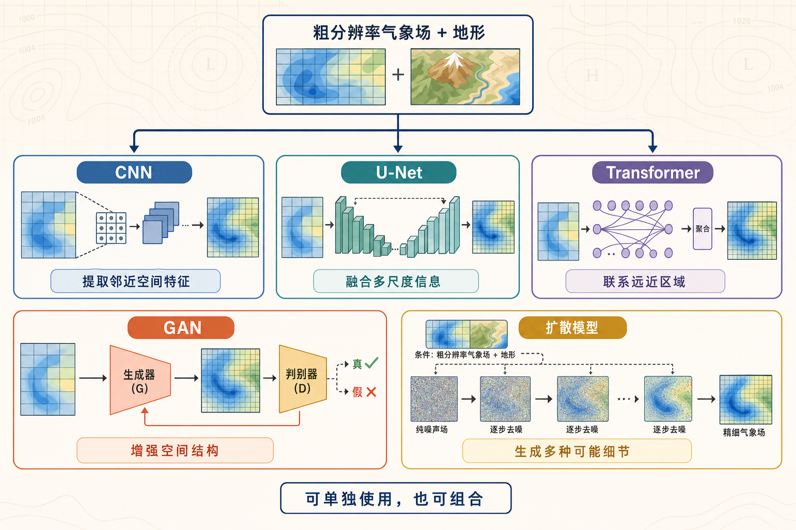

数值预报和再分析中的温度、风和降水，通常都表示在一张张网格上。网格间距越大，能够直接表示的空间结构越粗。大尺度天气形势可以保留下来，山谷、海岸线、城市建筑群附近的局地差异则容易被平均掉。

这也是为什么一份覆盖全国乃至全球的气象数据，到了城市通风、低空飞行、风能评估和精细灾害预警等任务里，常常显得不够细。气象降尺度要解决的，就是如何在已有大尺度资料的基础上，得到更细的区域信息。

> [!summary]
> AI 气象降尺度会学习粗分辨率资料、高分辨率地形信息与细网格目标之间的关系，再快速生成区域高分辨率气象场。
>
> 它适合重复生成、集合预报和固定区域应用，但输出质量受训练资料、区域、天气类型和物理约束影响。网格变细，不等于真实大气已经被完整还原。

# 从粗网格到细网格

## 为什么需要降尺度

全球预报和再分析需要处理整个地球的大气状态。计算范围很大，水平网格通常也比城市应用所需的尺度更粗。以常用于研究的 ERA5 为例，公开单层资料常见的网格是 0.25°；在中低纬地区，这大致对应几十公里量级，而且经度方向的实际距离还会随纬度变化。

一个这样的网格可能同时覆盖城区、水体、农田和山地。模式能够知道这一片区域的大尺度风向和温度背景，却很难直接表达每条山谷、每片建筑群附近的风速变化。

传统上，研究人员会使用 WRF 这类区域数值模式，把全球分析或预报作为初始场和边界条件，再结合更精细的地形、土地利用等资料进行区域模拟。WRF 官方文档也将这类真实个例描述为外部大气场与静态地理资料共同驱动的区域模拟。

这种做法通常称为动力降尺度。它会显式积分大气动力和物理过程，代价是需要较多计算资源和时间。另一条路线是统计降尺度：根据历史资料，学习大尺度变量与局地变量之间的关系。今天常说的 AI 降尺度，可以放在数据驱动的统计降尺度路线中理解，只是所用模型更复杂，能处理更多空间结构和变量关系。

这里还要区分插值和降尺度。插值会把网格加密，并根据邻近格点计算新数值。它能让图像更平滑，却没有获得建筑、地形和局地环流带来的新信息。AI 降尺度会从历史上的粗—细配对样本中学习这些关系，前提是训练资料确实包含可学习的规律。

## AI 模型是怎样学会的

一套常见训练数据会同时包含粗分辨率气象场和同一时刻的高分辨率目标场。粗场可以来自全球预报、再分析或较粗的区域模式；目标可以来自观测资料，也可以来自高分辨率数值模拟。

地形高度、土地利用、建筑高度、不透水面和植被等高分辨率静态资料也常被加入输入。它们不会告诉模型某一时刻具体会吹多大的风，却能帮助模型判断：相同的大尺度背景到达山地、河谷或建成区后，局地响应可能有什么差别。

训练前还要完成时间、坐标、网格、变量和单位的配对。这个环节没有算法名称那么显眼，却直接决定模型学到的关系是否可信。时间错一帧、风分量方向弄反、投影不一致，模型仍然可能正常收敛，输出却没有可解释的物理含义。

模型最终学到的是对目标资料的近似。如果高分辨率目标来自 WRF，输出主要接近该区域、该配置下的 WRF 结果；如果目标来自雷达或站点插值，模型也会继承观测覆盖和处理方法的限制。

因此，AI 降尺度不能简单理解成“从模糊图里找回原图”。同一个粗网格状态，可能对应多种合理的小尺度结构。稳定的地形响应比较容易学习，湍流、对流和极端天气中的局地变化则带有更强的不确定性。

# 常见算法各自做什么

## CNN 和 U-Net：把相对稳定的关系学好

气象网格与多通道图像有相似的数据结构。每个通道可以放温度、湿度、风分量或地形，卷积神经网络会在邻近网格间提取空间特征。2017 年发表的 [DeepSD](https://www.kdd.org/kdd2017/papers/view/deepsd-generating-high-resolution-climate-change-projections-through-single) 就把图像超分辨率中的卷积网络用于气候数据降尺度，并加入多尺度辅助信息。

U-Net 在卷积网络上增加了编码、解码和跨层连接。模型可以先概括大范围背景，再把不同尺度的特征带回高分辨率输出。对许多确定性降尺度任务来说，它是一条训练相对直接、推理很快的基线。[一项针对华北逐日 2 米温度的研究](https://doi.org/10.1029/2023EA003227) 同时测试了原始 U-Net，并在 U 形骨架上加入地形信息、残差模块和注意力机制，用于把数值预报结果做 10 倍空间降尺度。这也说明 U-Net 常被作为基础骨架继续改造。

这类模型经常使用均方误差或平均绝对误差训练。当一个粗分辨率输入对应多种可能的细尺度状态时，模型倾向于给出较稳定的平均结果。大范围风向和温度分布可能比较准确，细小纹理、尖锐梯度和分布尾部容易被削弱。

## Transformer：把更大范围的联系纳入计算

Transformer 使用注意力机制，让模型比较不同位置之间的关系。在气象场中，它可以帮助模型同时参考较远处的天气系统、地形和局地变量。

2026 年发表于 Nature Communications 的 [FuXi-CFD](https://www.nature.com/articles/s41467-026-70562-5) 把 1 km 背景风与 30 m 地形、地表粗糙度结合，通过 Transformer 编码器提取不同位置之间的联系，再重建 30 m 分辨率的三维近地面风场。模型使用大量 CFD 模拟作为训练资料，并用独立测风塔观测进行了检验；论文同时指出，当前训练资料对弱风和热力作用的覆盖仍然有限。

高分辨率网格仍会增加 Transformer 的显存和计算开销，模型也需要足够多样的训练样本。窗口大小、位置编码和区域边界会影响模型看到的空间关系。实际系统中，它常与卷积、插值或生成模型组合使用。

## GAN：让输出的空间结构更接近目标资料

生成对抗网络会同时训练生成器和判别器。生成器负责输出高分辨率气象场，判别器检查这些结果与目标资料在空间结构和统计分布上是否相似。

这种训练方式可以减少过度平滑。[U-LSGAN](https://doi.org/10.1175/AIES-D-24-0105.1) 将 U-Net 生成器与对抗训练结合，把 1 km 中尺度模式输出降到 200 m 分辨率的模拟网格，并对温度、相对湿度和近地面风速进行了测试。

GAN 的困难也很明确。训练过程对损失权重和样本分布较敏感，生成的细节看起来合理，也可能与该时刻的真实位置不一致。对气象应用来说，视觉更锐利只能算一项结果，还要检查数值误差、频谱、极端值和变量之间的关系。

## 扩散模型：为一个粗场生成多种可能细节

普通扩散模型在训练时不断给高分辨率目标加入噪声，再学习如何沿相反方向逐步去噪。用于降尺度时，粗分辨率气象场和地形等资料会作为条件输入，约束每一步去噪的方向。模型从随机噪声出发，经过多次修正后得到一张高分辨率气象场；更换初始噪声，还可以生成另一种同样合理的细节分布。

这种生成方式适合表达“一种大尺度背景对应多种小尺度状态”的问题，代价是需要反复去噪，训练和推理成本通常高于一次前向计算的 U-Net。直接生成完整气象场时，小尺度细节也可能干扰原本合理的大尺度结构。

[CorrDiff](https://doi.org/10.1038/s43247-025-02042-5) 因此采用了两阶段设计：先由 U-Net 给出稳定的平均场，再让扩散模型只生成残差，补充平均预测中缺少的小尺度变化。研究在台湾区域把 25 km 输入降到 2 km，并评估风、温度和雷达反射率等变量。结果显示，扩散步骤可以改善部分频谱与概率分布，但集合离散度校准和逐时连续性仍需继续处理。

# 从实验看应用边界

我最初尝试从约 0.25° 的资料直接生成 200 m 城市气象场，主要遇到了这些问题：

- 三维训练难度过大，目前使用的资源未能取得较好效果。
- 粗细网格跨度过大，输入中缺少足够的小尺度信息。
- 训练时段较短，模型难以覆盖不同季节和天气过程。
- U-Net 能恢复主要风场，小尺度变化仍偏弱。
- 直接加入扩散模型会增加纹理，也可能造成大尺度漂移。

如有做类似方向的同学可以参考，在设计训练框架时提前规避。

在训练完成后，观察训练效果时最直观的指标是 RMSE、MAE 和相关系数，它们能告诉我们预测值与目标值相差多少。但只看这些指标还不够。

比较可靠的评估还会检查功率谱、概率分布、极端事件命中情况和时间连续性。多变量模型需要检查温度、湿度、气压和风场之间是否保持合理关系。准备投入实际应用时，还要使用独立观测验证，并把不同季节、不同天气型和训练期之外的极端过程单独拿出来测试。

> [!warning]
> AI 降尺度生成的是受输入和训练资料约束的高分辨率估计。它不能凭空补回粗网格中已经丢失的唯一真实细节，也不能自动替代区域数值模式、资料同化和观测检验。

AI 降尺度适合固定区域、输入资料相对稳定且需要反复计算的任务，例如批量生成城市风场、风能资源、精细温度和降水数据。模型训练完成后可以快速处理大量时次、集合成员或气候情景，但换区域、换资料来源或遇到少见的极端天气时，表现可能明显下降。实际应用中，它更适合作为数值模拟和观测体系的快速补充，并继续接受独立观测检验。

# 总结

气象降尺度面对的是一个信息不完整的问题。粗分辨率资料提供大尺度天气背景，高分辨率地形和下垫面资料补充空间条件，细网格模拟或观测告诉模型需要接近什么目标。

CNN 和 U-Net 适合学习稳定的平均映射；Transformer 可以联系更大范围的空间信息；GAN 会强化输出的空间结构；扩散模型能够生成多种可能的小尺度状态。算法越复杂，越需要清楚的数据边界、尺度约束和评价体系。

真正可用的结果，既要看起来更细，也要在数值、频谱、极端事件、时间连续性和物理关系上经得起检查。网格变细只是第一步，知道这些细节从哪里来、在哪些条件下可信，才是 AI 气象降尺度需要回答的问题。

## 相关阅读

- [[corrdiff-paper|文献精读｜CorrDiff 算法]]
- [[kilogen-wind-downscaling|arXiv｜KiloGen：用扩散后验采样补回复杂地形风场]]
- [[pisr-physics-super-resolution|arXiv｜PISR：把原始方程写进大气超分辨率]]
