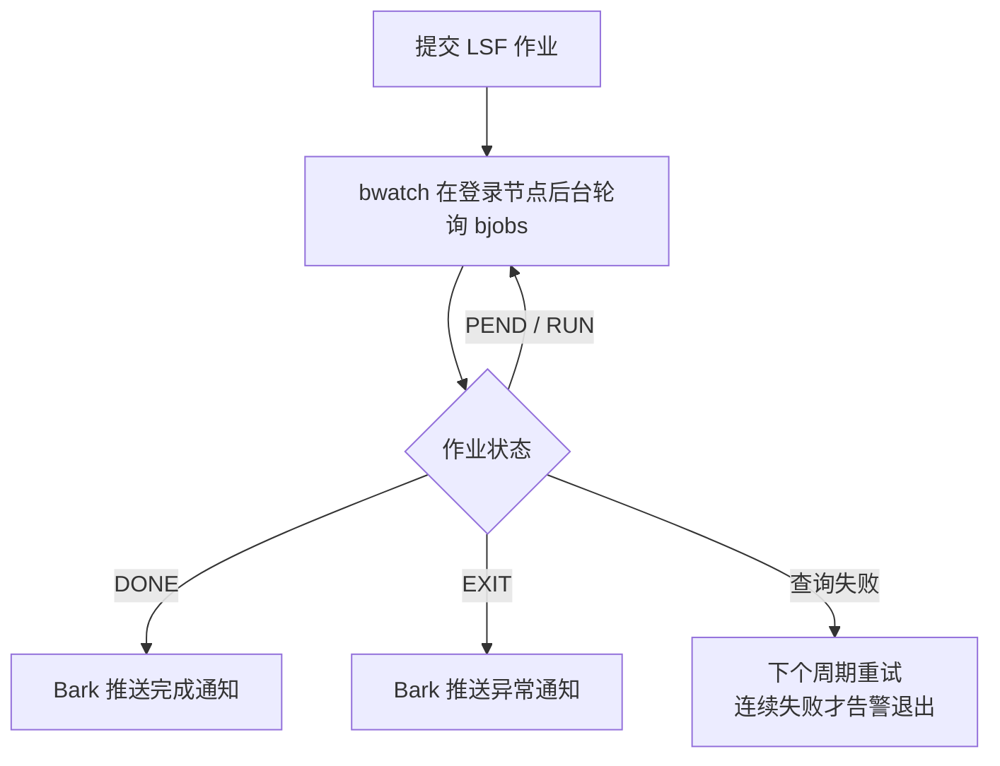

在服务器上跑长期任务时，最烦人的不是任务本身跑得久，而是你不知道它什么时候结束、是正常完成还是报错退出。

尤其是把 WRF、CMAQ、数据预处理、批量绘图这类任务提交到 LSF 作业系统以后，日常状态检查经常变成这样：

```bash
bjobs
bjobs -a
tail -f run.log
```

如果任务只跑十几分钟，手动看一眼还可以；如果任务要跑几个小时、十几个小时，甚至跨夜运行，就很容易出现两个问题：

- 任务早就完成了，但我还不知道，下一步分析被白白拖到第二天；
- 任务中途异常退出了，但我没及时看到，排查和重跑又往后延迟。

这类问题很适合交给自动化处理。我的做法是：写了一个常驻小工具 bwatch，在登录节点上定时轮询 LSF 作业状态，一旦作业完成或异常退出，就通过 Bark 把消息直接推送到手机。

> [!summary]
> Bark 作为一个消息推送工具，能完美适配成服务器长任务的“哨兵”。它把“我隔一会儿手动 `bjobs` 看看”变成了“任务有结果时自动通知我”。

使用效果：

![[用 Bark 发通知：掌控任务进度-20260704.png]]

# Bark 是什么

[Bark](https://github.com/Finb/Bark) 是一个 iOS 推送工具 App，可以通过一个 HTTP 请求向自己的 iPhone 发送自定义通知。它基于 Apple Push Notification service，官方 README 里也提到它支持分组、自定义图标、声音、时效性通知、重要提醒、自建服务器和加密推送等功能。

它的基本使用方式很简单：

1. 在 iPhone 上安装并打开 Bark；
2. 复制 App 里给出的推送 URL 或 key；
3. 在服务器、脚本或自动化程序里请求这个 URL；
4. 手机收到通知。

Bark 官方文档入口在 [bark.day.app](https://bark.day.app/#/en-us/)，服务端项目也单独开源在 [Finb/bark-server](https://github.com/Finb/bark-server)。如果默认的 `api.day.app` 在某些服务器网络里不可访问，也可以考虑自建 Bark Server。

> [!important]
> Bark 的关键点是“脚本友好”。只要一个地方能发 HTTP 请求，就能把结果推送到手机。对服务器任务监控来说，这比邮件、微信文件传输助手、手动刷新网页都轻很多。

# 用 Bark 监控 LSF 长任务

## 典型使用场景

我在服务器上经常会提交这类任务：

```bash
bsub < run_wrf.lsf
bsub < run_cmaq.lsf
bsub < preprocess.lsf
```

提交后 LSF 会返回一个作业号，比如：

```txt
Job <123456> is submitted to queue <normal>.
```

之后如果想知道状态，就需要反复查：

```bash
bjobs 123456
bjobs -a 123456
```

LSF 的常见状态大致可以这样理解：

| 状态 | 含义 | 是否需要推送 |
|---|---|---|
| `PEND` | 排队等待资源 | 通常不需要 |
| `RUN` | 正在运行 | 通常不需要 |
| `DONE` | 正常完成 | 需要 |
| `EXIT` | 异常退出 | 需要，而且要尽快看日志 |

所以监控这件事不需要做得很复杂。bwatch 的核心逻辑就是：



> [!note]
> 这类监控不是为了替代 LSF，也不是为了实时追踪每一秒的资源变化。它只解决一个高频痛点：任务有结果时，第一时间告诉我。

## 先测试 Bark 能不能推送

在 iPhone 的 Bark App 里复制自己的 key。下面用占位符表示：

```bash
export BARK_KEY="your_bark_key"
```

先在服务器上测试一次：

```bash
curl -X POST "https://api.day.app/${BARK_KEY}" \
  --data-urlencode "title=服务器测试" \
  --data-urlencode "body=Bark 推送已经连通" \
  --data-urlencode "group=LSF"
```

如果手机能收到通知，说明服务器到 Bark API 的网络是通的。

如果收不到，先检查三件事：

- `BARK_KEY` 是否复制完整；
- 服务器能否访问 `https://api.day.app`；
- Bark App 的通知权限是否已经打开。

> [!warning]
> `BARK_KEY` 相当于你的推送入口，不建议写进公开仓库，也不要放在会被别人看到的日志里。我自己是把 key 统一放在 `~/.config/bark/config` 里，服务器上所有需要推送的工具（包括下面的 bwatch）都从这个文件读取，换手机时只改这一处，不用动任何代码。

## 用 bwatch 监控作业

早期我确实是用一个 shell 脚本循环 `bjobs` 来做这件事的，但脚本每次都要手动挂后台、防止重复启动、处理查询失败，越补越长。后来干脆把这套逻辑固化成一个小工具 bwatch：一个 shell 入口加几个 Python 模块（作业查询、轮询循环、Bark 推送），常驻在登录节点上。这里不贴源码，只讲用法和行为。

日常使用只需要一条命令：

```bash

# 监控当前用户所有正在运行的作业（自动发现）
bwatch

# 监控指定作业
bwatch 342 456

# 通过 SSH 到别名节点查询（比如独立的 GPU 集群）
bwatch 342 -s gpu

# 轮询间隔改为 5 分钟（默认 10 分钟）
bwatch -i 5
```

管理已经启动的监控：

```bash
bwatch -l             # 列出正在运行的监控进程
bwatch -k <PID>       # 停掉某个监控
bwatch -c             # 清理过期或过大的日志
bwatch 342 -f         # 前台运行（调试用）
```

几个设计上省心的行为：

- 默认后台运行：命令立即返回，打印 PID 和日志路径，不需要自己套 `nohup` 或 `tmux`；
- 防重复启动：参数完全相同的实例互斥，重复执行会提示已在运行；参数不同的实例可以并行；
- 自动收尾：监控的作业全部结束后，进程自己退出，不会留下一堆僵尸监控；
- 查询容错：SSH 瞬时超时或连接失败不会被误判成“作业结束”，而是下个周期重试；连续失败多次才推送告警并退出；
- 日志自动清理：每次启动时静默删除 30 天前或超过 100 MB 的旧日志。

> [!important]
> bwatch 必须跑在登录节点，而不是把推送写进 LSF 作业脚本。原因很简单：计算节点没有外网，作业脚本里的通知逻辑写得再对也发不出去。让登录节点从外部轮询 `bjobs` 代发通知，是这种集群网络条件下唯一稳妥的方案。

## 通知长什么样

作业结束时，每个作业推送一条通知：

| 事件 | 标题 | 级别与铃声 |
|---|---|---|
| 正常完成 | `✅ Job 342 DONE` | timeSensitive + bell，穿透专注模式 |
| 异常退出 | `❌ Job 342 EXIT` | timeSensitive + alarm，铃声更刺耳 |
| SSH 持续失败 | `⚠️ bwatch SSH Failed` | timeSensitive + alarm |

正文只有一行：作业名和完成时间，比如 `train_swin_ds | 14:32`。

所有通知归入 `bwatch` 分组，在手机通知列表里一眼就能和其他推送区分开。分组、key、图标这些默认值都放在 `~/.config/bark/config` 里，想改也不用动代码。

## 和 bsub 提交流程配合起来

最朴素的方式是先提交作业，再复制 Job ID：

```bash
bsub < run_wrf.lsf
bwatch 123456
```

也可以把提交结果里的 Job ID 自动提取出来：

```bash
jobid=$(bsub < run_wrf.lsf | sed -n 's/.*<\([0-9]\+\)>.*/\1/p')
bwatch "${jobid}"
```

bwatch 自己会转到后台，所以不需要再套 `nohup`，提交完就可以退出终端。

更省事的做法是：批量提交完所有作业后，直接执行不带参数的 `bwatch`，它会自动发现当前用户所有正在运行的作业，一起监控。

如果 GPU 集群和 CPU 集群的 LSF 相互独立，登录节点的 `bjobs` 看不到 GPU 作业，就用 SSH 查询模式：

```bash
bwatch  -s gpu
```

bwatch 本体仍然跑在登录节点（因为只有它能上外网发推送），只是把查询这一步改成 SSH 到 GPU 节点执行 `bjobs`。

## 异常退出时，通知里应该写什么

只推送“任务失败了”其实还不够。真正有用的通知最好包含三类信息：

| 信息 | 作用 |
|---|---|
| Job ID | 方便回到服务器上查 `bjobs -l` 或 `bhist` |
| 作业名 | 区分是 WRF、CMAQ、预处理还是绘图任务 |
| 状态 | DONE 还是 EXIT，决定下一步是继续分析还是查日志 |

bwatch 的通知标题和正文刻意只保留这三样。收到异常提醒后，我一般会立刻回服务器看：

```bash
bjobs -l 123456
bhist -l 123456
tail -n 100 run.log
```

> [!question]
> 为什么不直接把完整日志推送到手机？
>
> 因为手机通知适合传递结论，不适合承载长日志。通知里只需要给出“哪一个任务、出了什么状态、下一步去哪里看”，详细排查还是回服务器上处理。

# 扩展场景和使用建议

## 把 Bark 接到更多服务器自动化里

LSF 任务监控只是最直接的一个场景。只要脚本能判断“某件事发生了”，就可以接 Bark：

- 磁盘超过阈值时推送；
- 数据下载失败时推送；
- 每日备份失败时推送；
- 批量绘图完成时推送；
- 模式输出目录出现新文件时推送；
- 某个日志里出现 `ERROR`、`FATAL`、`Traceback` 时推送。

例如，检查磁盘使用率后推送：

```bash
usage=$(df -h /WORK | awk 'NR==2 {print $5}' | tr -d '%')
if [[ "${usage}" -ge 85 ]]; then
  curl -fsS -X POST "https://api.day.app/${BARK_KEY}" \
    --data-urlencode "title=服务器磁盘告警" \
    --data-urlencode "body=/WORK 使用率已达到 ${usage}%" \
    --data-urlencode "group=Server"
fi
```

再比如，脚本运行失败时推送：

```bash
if ! bash run_preprocess.sh; then
  curl -fsS -X POST "https://api.day.app/${BARK_KEY}" \
    --data-urlencode "title=预处理任务失败" \
    --data-urlencode "body=run_preprocess.sh 执行失败，请查看日志。" \
    --data-urlencode "group=Workflow" \
    --data-urlencode "level=timeSensitive"
fi
```

## 我的使用建议

> [!note]
> Bark 最适合放在“结果通知”这一层，而不是把所有过程信息都推到手机。推送太多以后，真正重要的失败提醒反而会被淹没。

* 只推送完成、失败、超阈值这类需要行动的事件。
* 普通运行状态留在日志里，不要每隔几分钟都推手机。
* 异常通知里一定写清楚 Job ID 和作业名，回服务器第一时间能定位。
* 对跨夜任务、长队列任务、批量任务优先接入 Bark。

对我来说，Bark 最大的价值是把一个非常具体的科研工作流问题得到丝滑解决：服务器上的长期任务不再需要我反复 `bjobs`，该完成时手机告诉我，该失败时也能第一时间提醒我。

## 相关阅读

- [[tmux-server-workbench|tmux：把一个终端变成服务器工作台]]
- [[research-automation|科研自动化流程]]
- [[linux-research-tools|科研服务器上我常用的 Linux 小工具]]
