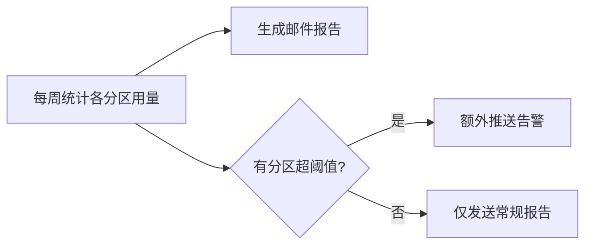
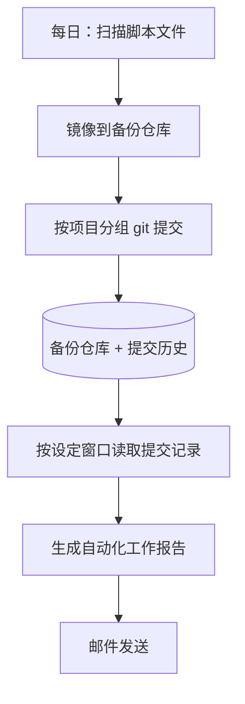

服务器用久了以后，我发现很多麻烦并不是来自某个大问题，而是来自一堆小事反复消耗注意力：磁盘快满了才想起来看，脚本改了半个月却没留下备份，写阶段总结时又要翻聊天记录和提交记录。

这些事不值得每天手动做，但也不能完全不管。所以我把服务器上的几类日常维护任务整理成了定时脚本：该检查的检查，该备份的备份，该汇总的汇总。

这篇记录我现在还在用的几套科研自动化流程。重点不在代码细节，而是它们分别解决什么问题、多久跑一次、失败时去哪里看。

> [!summary]
> 这一套自动化主要做四件事：看磁盘、备份代码、生成自动化工作报告、按月补充公共数据。

# 1. 总览

这些程序都按定时任务运行，彼此独立。某一个脚本失败，不会拖垮其它任务。

| 程序 | 运行频率 | 主要功能 | 产出 |
|---|---|---|---|
| 磁盘监控 | 每周一 | 统计各分区存储用量 | 邮件报告 + 超阈值告警 |
| 文件备份 | 每日 | 镜像脚本文件，并用 git 记录增量变化 | 备份仓库 + 提交历史 |
| 自动化工作报告 | 每周或每月 | 读取提交记录，生成进展或阶段总结 | 邮件报告 |
| 公共数据自动下载 | 每月某日 | 下载并整理模式所需公共数据 | 数据入公共区 + 邮件汇报 |

> [!tip]
> 每个程序都会写自己的日志。出问题时看日志即可修复。

# 2. 磁盘监控

这是最基础的一项，也是最容易被忽略的一项。服务器磁盘一旦满了，轻则任务中断，重则输出文件损坏，所以我让脚本每周固定检查一次。

它主要做三件事：

- 按配置里的路径统计存储用量，比如数据分区、用户目录和公共目录；
- 生成文本版和 HTML 版报告，通过邮件发送；
- 如果某个分区超过阈值（默认 80%），额外发一条即时告警。



> [!note]
> 监控哪些路径、阈值设多少，都放在配置文件里。临时调整规则时，只改配置，不动主程序。

# 3. 每日文件备份

科研脚本最怕的不是“没写完”，而是“写过但找不回来了”。尤其是服务器上多个项目同时跑，今天改一个预处理脚本，明天改一个绘图脚本，过一阵子很难记清哪一版对应哪个结果。

所以我每天做一次轻量备份。这一步刻意保持简单：**不调用 AI、不发邮件**，只负责把关键文件留下来。

具体来说，它做两件事：

1. 把数据区里的脚本和配置文件镜像到一个固定备份目录；
2. 按项目分组，在备份仓库里做一次 git 增量提交。

备份只覆盖“代码与配置”，不碰大数据：

| 会备份 | 不会备份 |
|---|---|
| `.py` `.sh` `.ipynb` `.R` `.jl` `.sql` 等脚本 | NetCDF、npy、pkl、h5 等数据文件 |
| Dockerfile、CMake 等构建文件 | zip、tar、gz 等压缩包 |
| 单文件小于 50 MB | 超大文件、缓存、conda 环境 |

> [!warning]
> 这个备份目录是一个**独立的 git 仓库**，只放镜像出来的脚本和配置，和各项目自己的 git 历史分开，避免互相污染。

# 4. 自动化工作报告

每日备份留下的 git 历史不仅能防丢文件，还能反过来回答一个很实际的问题：这段时间我到底改了什么？

基于这个思路，我又加了自动化工作报告。它其实是一类任务：固定读取一段时间内的提交历史，再生成对应窗口的工作总结。短周期可以每周跑一次，长一点的阶段总结可以每月跑一次，差别只在统计窗口和触发时间。

| 报告类型 | 统计窗口 | 频率 |
|---|---|---|
| 自动化工作报告 | 最近一周或最近一个月 | 每周或每月 |

整体流程是：每日备份先把脚本变化提交进备份仓库，报告脚本再读取这段提交历史，让模型帮我整理成一份可读总结。



这里我有意把“备份”和“报告”拆开。备份脚本只管存文件和提交，报告脚本只读历史、不再重复扫描。这样即使某次报告生成失败，也不会影响当天备份。

> [!note]
> 如果报告按月生成，日期可以固定在每月某一天。这样当天备份先完成，再统计这一轮窗口里的提交，尽量避免漏掉最后一天的改动。

# 5. 公共数据自动下载

数值模式经常需要补充公共驱动数据和观测输入。手动下载容易漏月份，也容易下重复文件，所以我把这部分也放进定时任务里。

这类任务的逻辑基本相同：

- 按月份检查需要补齐的数据范围；
- 跳过已经存在的文件，避免重复下载；
- 下载完成后按固定目录结构整理到公共数据区；
- 结束时发送邮件，说明新增了哪些文件、有没有失败项。

> [!tip]
> 下载脚本都保留了测试模式和失败重试清单。网络抖动导致个别文件失败时，可以单独补下，不必整批重跑。

# 6. 用 crontab 挂定时任务

这些任务本质上都是定时运行的脚本。在 Linux 服务器上，最常见的做法是用 `crontab`。它的好处是轻量、稳定，不需要额外部署服务。

查看当前用户已有的定时任务：

```bash
crontab -l
```

编辑当前用户的定时任务：

```bash
crontab -e
```

每一行通常由“时间 + 命令”组成，前 5 列分别表示分钟、小时、日期、月份、星期：

```text
分 时 日 月 周  要执行的命令
```

例如，每周一早上 8 点跑磁盘检查：

```cron
0 8 * * 1 /bin/bash /path/to/check_disk.sh >> /path/to/logs/check_disk.log 2>&1
```

每天凌晨 2 点跑文件备份：

```cron
0 2 * * * /bin/bash /path/to/backup_scripts.sh >> /path/to/logs/backup_scripts.log 2>&1
```

每月 1 日早上 9 点生成自动化工作报告：

```cron
0 9 1 * * /bin/bash /path/to/generate_work_report.sh >> /path/to/logs/work_report.log 2>&1
```

这里有几个细节很重要：

- 尽量写绝对路径，不要依赖当前目录；
- 把标准输出和错误输出都重定向到日志里，也就是 `>> log 2>&1`；
- 如果脚本依赖 conda 环境、环境变量或特定工作目录，要在脚本内部显式处理；
- 修改完 `crontab` 后，可以用 `crontab -l` 再确认一遍。

> [!warning]
> `crontab` 默认使用的是当前用户权限。需要读写公共目录时，要确认这个用户本身就有权限，不要把权限问题留到脚本运行时才发现。

# 7. 几个通用约定

这几套程序解决的问题不同，但我尽量让它们遵循同一组约定：

- **邮件 / 推送**：常规报告走邮件，磁盘超阈值时再加一条即时推送。
- **配置与密钥分离**：邮箱、收件人、API key 等敏感信息放在独立配置里，**不进 git，也不直接写进脚本**。
- **日志先行**：每个程序都有独立日志，排查问题时先看最近一次运行记录。
- **失败隔离**：任务之间不串联，一个失败不影响其它任务继续跑。
- **保留历史**：停用过的任务在调度表里注释保留，方便以后查原因，而不是直接删掉。

# 总结

科研服务器上的自动化不用一开始就做得很复杂。对我来说，先把下面几件事稳定下来就已经很有价值：

1. 磁盘、备份这种“出事才后悔”的事，交给程序盯着；
2. 备份只存代码与配置，大数据用更适合的方式管理；
3. 自动化工作报告基于 git 历史生成，少靠临时回忆；
4. 敏感信息和代码分开，后续分享、迁移和交接都更省事；
5. 每个程序都留下日志，至少能查到它上次跑了什么、有没有跑成功。

这些任务挂上定时调度之后，平时基本不用管。真正需要看的，就是邮箱里的报告，以及偶尔弹出来的告警。

## 相关阅读

- [[literature-automation|文献调研的自动化流程配置]]
- [[bark-job-notifications|用 Bark 发通知：掌控任务进度]]
- [[research-git|AI 时代，科研项目为什么更需要 Git]]
- [[research-project-folders|科研项目文件夹怎么组织]]
