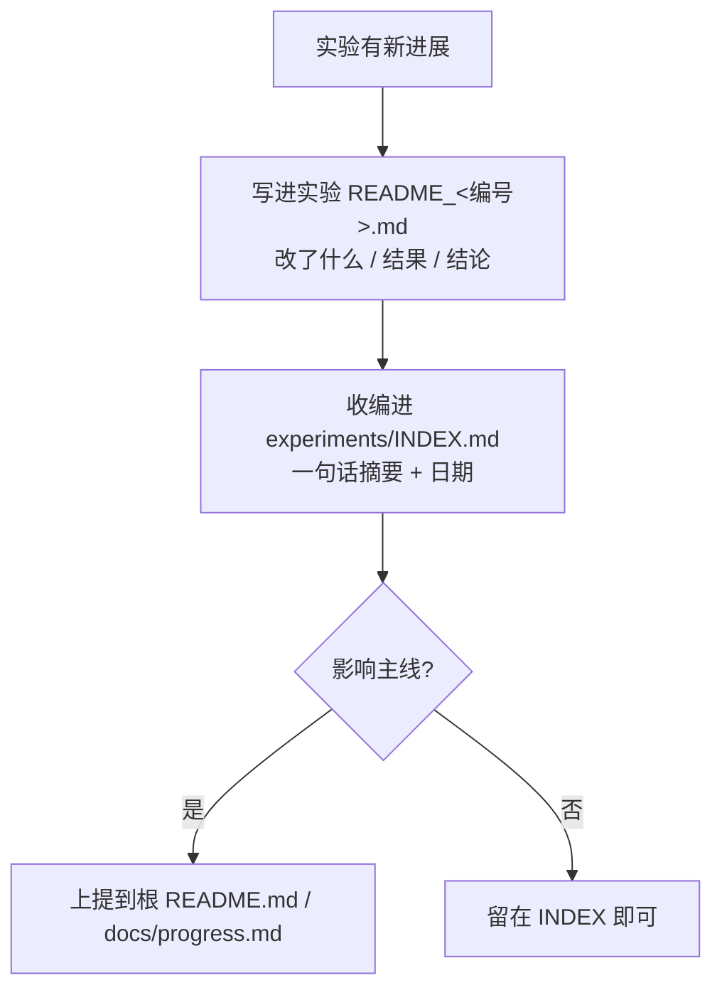

做科研项目时，文件夹混乱会很快变成一个真实问题：脚本不知道哪个是最新版，数据不知道从哪里来，图不知道对应哪次实验，最后写论文时连自己都复现不了。

这篇整理一套我更推荐的科研服务器文件组织方式，尤其适合数值模式、数据分析和机器学习项目。

> [!summary]
> 好的目录结构不是为了“看起来专业”，而是为了三件事：找得到、跑得通、能复现。

# 1. 先区分 Model、Data 和 Project

我会先把服务器上的内容分成三类：

| 顶层目录 | 放什么 | 例子 |
|---|---|---|
| `Model` | 模式源码、预处理工具、编译版本 | WRF、LPDM、F0AM、ANTHRO |
| `Data` | 输入、输出、观测、静态数据 | wrfout、排放源、站点观测 |
| `Project` | 具体研究项目和实验脚本 | 城市个例、AI 降尺度、论文实验 |

这样做的好处是：模式本体、数据资产和研究项目不会互相缠在一起。

# 2. Model 目录：按模式和版本管理

模式目录建议按软件和版本拆开：

```txt
Model
├── WRF                      # WRF 模式，按版本分目录
│   ├── version3.9
│   ├── version4.1.1
│   ├── version4.1.1-LES
│   ├── version4.2-CMAN
│   └── version4.5.2
├── WRF-SCM                  # WRF 单柱模式
├── OBSGRID                  # 客观分析 / 观测打包预处理
├── LPDM                     # 拉格朗日扩散 / 轨迹模式
│   ├── flexpart
│   ├── flexpart-wrf-master
│   ├── hysplit
│   ├── LPDM-CLUSTER
│   ├── LPDM_gdas
│   └── make_ARL
├── emission                 # 排放源预处理工具
│   ├── ANTHRO
│   ├── ANTHRO_revised
│   ├── emis_00to24z
│   └── MEGAN
├── F0AM                     # 大气化学箱模式
├── config_templates         # 各模式通用配置模板
└── run_scripts              # 编译 / 运行脚本
```

> [!tip]
> 模式源码不要和某个项目的实验脚本混放。项目里只保留调用脚本、配置文件和说明文档，模式本体放在统一的 `Model` 下。

# 3. Data 目录：输入、输出、观测和静态数据分开

数据目录可以按数据类型组织：

```txt
Data
├── Input                    # 各模式的输入数据
│   ├── gdas
│   ├── lpdm
│   ├── megan
│   ├── obsgrid
│   ├── wps
│   └── wrf
├── Output                   # 模式输出
│   ├── lpdm
│   └── wrfout
├── observation              # 观测数据，按来源分目录
│   ├── ncdc
│   ├── gsod
│   ├── wyoming
│   ├── surface_station
│   └── sounding
├── Static                   # 静态 / 下垫面数据
│   ├── topography
│   ├── boundary
│   ├── landuse
│   ├── NDVI
│   ├── impervious
│   ├── population
│   ├── building_heights
│   ├── LocalClimateZone
│   └── emission
└── download                 # 原始下载数据（保持只读，不直接修改）
```

我比较建议把 `download` 单独放出来。原始下载数据尽量不直接修改，后续处理生成的数据放到 `Input` 或项目目录中。

> [!warning]
> 原始数据和处理后数据不要混在一个文件夹里。否则几个月后很难判断哪些文件可以删、哪些文件必须保留。

# 4. Project 目录：围绕研究问题组织

一个具体项目可以这样组织（`#` 后为该一级目录的核心作用）：

```txt
.
├── README.md           # 项目总览：背景、目录索引、整体进展与主要结论
├── LICENSE
├── archive             # 旧版本、废弃实验或不再使用的材料
├── configs             # 公共配置文件
├── data                # 项目数据
│   ├── raw             # 原始数据或软链接（只读，不直接修改）
│   └── derived         # 清洗后的派生 / 中间数据
├── docs                # 技术路线、进展记录等长期文档
│   ├── progress.md
│   └── technical_route.md
├── experiments         # 每次实验的脚本、日志、图和结果（项目核心）
│   ├── INDEX.md        # 实验注册表，登记每个实验的日期与作用
│   ├── _shared         # 跨实验共享的数据管线和工具
│   ├── evaluation      # 统一的跨实验评估脚本
│   ├── 1.preprocess    # 实验 1：数据预处理
│   ├── 2.baseline      # 实验 2：基线模型
│   └── 3.sensitivity   # 实验 3：敏感性测试
├── figures             # 跨实验汇总、对外展示用图
├── logs                # 运行日志、环境检查记录
├── model               # 本项目用到的模式运行目录或软链接
├── reports             # 阶段报告、组会材料
├── tasks               # 当前计划（plan.md）与待办（todo.md）
└── utils               # 可复用工具函数
```

其中最重要的是 `experiments`。每次实验都应该有独立文件夹，避免覆盖历史结果。

> [!tip]
> 把所有实验共享的数据管线放进 `experiments/_shared`，跨实验对比统一走 `experiments/evaluation`。这样改一处就能全局生效，也不会出现各实验各算各的指标、最后对不上的情况。

# 5. 实验目录命名

我现在习惯用更简单的命名，把日期和描述交给注册表去记：

```txt
编号.主题
```

需要从某个实验派生出子实验时，用 `主编号-子编号`：

```txt
1.preprocess
1-2.validation
2.baseline
3.sensitivity
```

这样排序稳定，一眼能看出实验之间的衍生关系，目录名也不会越来越长。具体的创建日期、作用和产物统一登记在 `experiments/INDEX.md` 里。

每个实验目录至少保留：

```txt
README_<编号>.md
src/ 或主脚本
logs/
figures/
output/
cache/
tests/
```

> [!note]
> `README` 不需要写很长，但至少要说明：这次实验改了什么、输入是什么、输出在哪里、主要结论是什么。成熟的实验目录会自然长出 `configs/`、`docs/`、`report/` 等子目录，但起步时保持骨架最小即可。

# 6. 文档规范：README、INDEX 与逐级收编

光有目录还不够，得让“做了什么、结论是什么”能被人（以及半年后的自己）读到。我用三层文档来兜住信息，并约定一个自下而上的收编流程。

## 三层文档

| 层级 | 文档 | 作用 |
|---|---|---|
| 实验级 | 每个实验目录下的 `README_<编号>.md` | 这一个实验本身：改了什么、输入输出在哪、主要结论 |
| 实验集 | `experiments/INDEX.md` | 实验注册表：一行登记一个实验的日期、作用与产物 |
| 项目级 | 根目录 `README.md` | 项目总览：背景、目录索引、整体进展与重要结论 |

> [!note]
> 三层文档的详略是递减的：实验 README 最细，INDEX 一行一个实验，根 README 只留主线。

## 逐级收编流程

每当一个实验有了新进展，信息要自下而上逐级收编，而不是只躺在某个脚本的注释里：

1. **写进实验 README**：先在 `README_<编号>.md` 里更新这次跑了什么、结果如何、结论是什么。
2. **收编进 INDEX**：把一句话摘要登记 / 更新到 `experiments/INDEX.md`，让其他实验一眼能定位它。
3. **上提到根 README / docs**：如果是影响主线的结论或里程碑，再提炼进根 `README.md` 或 `docs/progress.md`。



> [!tip]
> 这样任何人从根 README 进来，都能顺着 INDEX 找到具体实验，再读实验 README 看细节——信息有层次、可追溯，不会散落一地。

# 7. 快速创建项目目录的脚本

可以写一个 `init_project.sh`：

```bash
#!/bin/bash
set -e

if [ $# -ne 1 ]; then
    echo "Usage: $0 <project_name>"
    exit 1
fi

PROJECT_NAME="$1"

if [ -d "$PROJECT_NAME" ]; then
    echo "Error: Directory '$PROJECT_NAME' already exists"
    exit 1
fi

mkdir -p "$PROJECT_NAME"
cd "$PROJECT_NAME"

mkdir -p archive
mkdir -p configs
mkdir -p data/raw
mkdir -p data/derived
mkdir -p docs
mkdir -p experiments
mkdir -p figures
mkdir -p logs
mkdir -p model
mkdir -p reports
mkdir -p tasks
mkdir -p utils

touch README.md
touch LICENSE
```

再写一个实验初始化脚本，创建骨架的同时自动登记到 `INDEX.md`：

```bash
#!/bin/bash

# init_exp.sh - 创建实验目录并自动登记

set -e

if [ $# -lt 2 ]; then
    echo "Usage: $0 <experiment_number> <experiment_name> [description]"
    echo "Example: $0 9 surface_2d \"Investigate XXX\""
    exit 1
fi

EXP_NUM="$1"
EXP_NAME="$2"
EXP_DESC="${3:-No description}"
FULL_DATE=$(date +"%Y-%m-%d")
EXP_DIR="${EXP_NUM}.${EXP_NAME}"

if [ -d "$EXP_DIR" ]; then
    echo "Error: Experiment directory '$EXP_DIR' already exists"
    exit 1
fi

mkdir -p "$EXP_DIR/cache"
mkdir -p "$EXP_DIR/figures"
mkdir -p "$EXP_DIR/logs"
mkdir -p "$EXP_DIR/output"
mkdir -p "$EXP_DIR/tests"

cat > "$EXP_DIR/README_${EXP_NUM}.md" << EOREADME
# Experiment $EXP_NUM - ${EXP_NAME}

* **Created Date:** $FULL_DATE
* **Description:** $EXP_DESC

## Tasks:

1.
EOREADME

# 自动登记到 INDEX.md
echo "| **$EXP_NUM** | $FULL_DATE | \`${EXP_DIR}\` | $EXP_DESC |" >> "INDEX.md"

echo "Experiment created and registered: $EXP_DIR"
```

# 8. 哪些文件应该进入 Git

| 建议进入 Git | 不建议进入 Git |
|---|---|
| 脚本 | 大型 NetCDF / zarr 输出 |
| 配置模板 | 中间缓存 |
| README、INDEX | 临时日志 |
| 小型示例数据 | 原始大数据 |
| 绘图代码 | 模型权重 / 可重复生成的大图 |

对于大型数据，可以用路径说明、下载脚本、数据清单或软链接记录来源。

# 总结

科研项目的目录结构没有唯一标准，但至少应该满足：

1. 模式源码、数据、项目分开；
2. 原始数据和处理后数据分开；
3. 每次实验有独立目录，并在注册表里登记；
4. 脚本、配置、日志、图件能互相对应；
5. 半年后还能看懂自己做过什么。

目录结构整理好之后，后面的 Git 管理、论文复现、组会汇报和交接都会轻松很多。

## 相关阅读

- [[research-git|AI 时代，科研项目为什么更需要 Git]]
- [[uv-python-environments|uv 管理 Python 环境：从入门到和 Conda 的取舍]]
- [[research-automation|科研自动化流程]]
