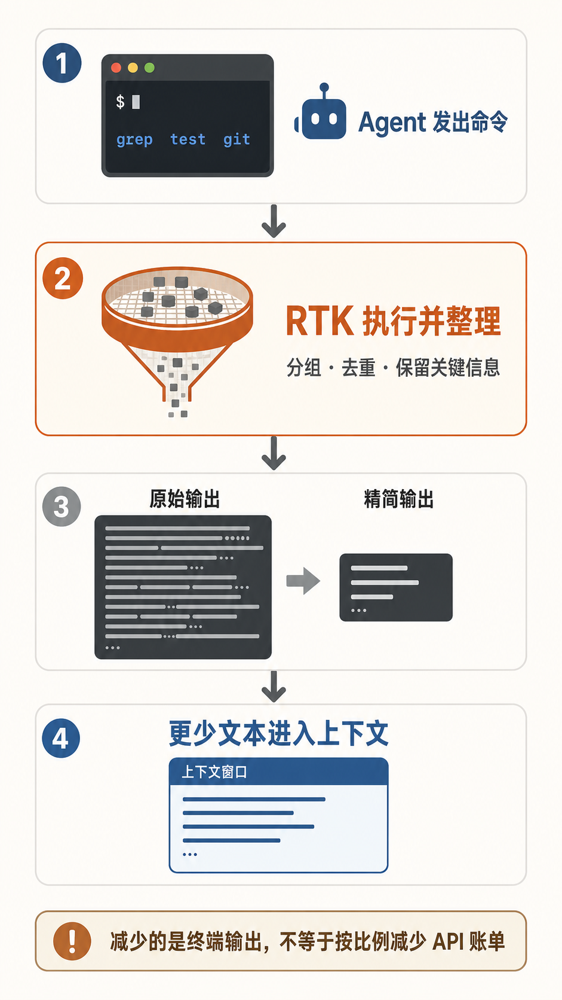

服务器是我的工作主力，Claude Code 经常要在目录和文件里搜索。一次 `grep` 消耗多少 tokens 并不显眼，架不住它反复执行，碰到大结果时又很长。于是我找到了 rtk

# RTK：压缩终端信息

[RTK](https://github.com/rtk-ai/rtk) 的全称是 Rust Token Killer。这个项目受到关注，是因为 coding Agent 会把终端结果带进后续上下文，而测试日志、搜索结果和 Git 输出里常有大量重复信息。RTK 作为本地命令行代理，先运行原命令，再按照命令类型整理结果。搜索会按文件分组并截短长行，测试只展开失败项，Git 状态和 diff 也会去掉一些头信息。

我把它装在终端里的 Claude Code 中。官方提供的钩子会在 Bash 命令执行前完成改写，例如把 `git status` 换成 `rtk git status`，用户自己的操作习惯不用跟着改。

我在服务器的 `rtk gain` 显示，累计输出缩减约 82%。进程列表这类规整的长输出能压掉 98% 以上；`grep` 单次比例低得多，却因为调用频繁，贡献了大部分累计节省。

需要注意的是，压缩也会带来部分信息的失真。RTK 可以把失败命令的完整输出保存在本地，Agent 需要时再读，也允许排除不适合过滤的命令。

# 还有其它同类工具

我又查了几款相关工具。

[Token-Saver](https://github.com/ppgranger/token-saver) 是 Claude Code 插件，用针对不同命令的处理器压缩终端结果。它与 RTK 占的是同一个位置。

[Headroom](https://github.com/headroomlabs-ai/headroom) 管得更宽。它可以作为本地代理、库或 MCP 服务处理工具结果、文件、JSON 和对话历史，还能在本地保留原文供模型按需取回。这样的范围适合需要统一管理整段上下文的 Agent 系统。

[claude-mem](https://github.com/thedotmack/claude-mem) 处理的是跨会话记忆。它借助 Claude Code 的生命周期钩子记录工具调用，由后台模型把过程压成观察和摘要，保存在本地数据库。新会话先注入一份紧凑索引，细节等需要时再查，因而可以减少为了恢复现场而重读文件、重放整段历史所占的上下文。

## 相关阅读

- [[claude-code-server|如何在服务器上使用 Claude Code]]
- [[linux-research-tools|科研服务器上我常用的 Linux 小工具]]
