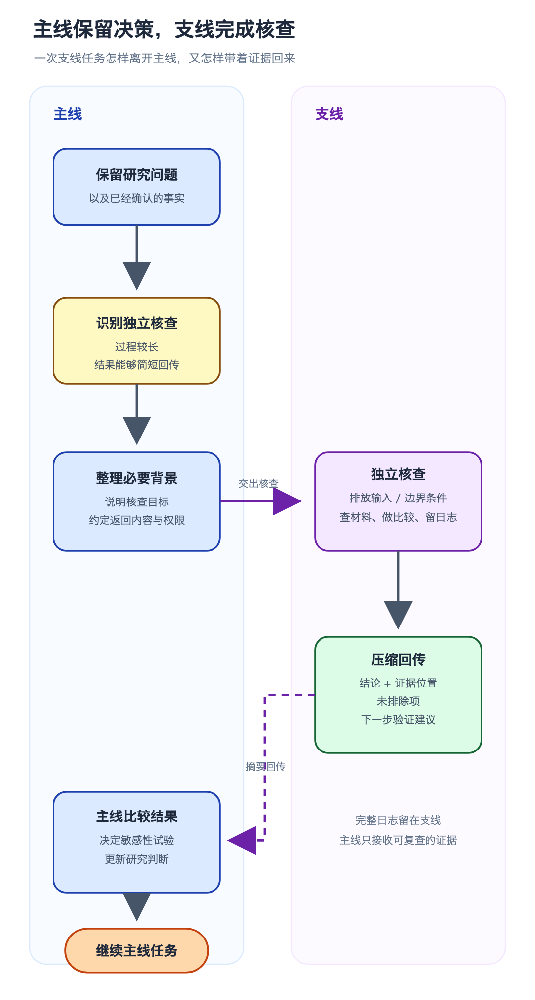

我们的日常工作常常要借用 AI 的帮助，有时会不自觉地在一个对话中提问太多轮次，甚至最新问题已经和前面的问题没有太大关系了，消耗了过多的上下文，使 AI 的回复质量明显下降，而这是需要重点规避的。

> [!summary]
> 能独立完成，又能用一份短结果回到主线的核查，更适合交给支线对话或 subagent。

例如当我用 WRF-Chem 分析一次臭氧污染时，如果出现模拟偏差过大的问题，主对话里已经放进了研究区域、模拟时段、观测对比和前面几轮判断。这时又出现两条需要核查的线索：排放输入的日变化可能有问题，也可能从上风向带入了偏高的臭氧。

两条线索都值得检查，过程却并不简单。排放这边要翻输入文件、处理脚本和不同版本的配置，边界条件那边要对照风向、边界浓度和高值出现的时段。中间还会产生不少日志、表格和临时图。若全部留在一个主对话里展开，需要长期保留的研究目标和已确认事实，很容易被这些检查过程挤到后面。

于是，我选择另开支线对话，或者把核查交给 subagent。按照 [OpenAI 的官方说明](https://learn.chatgpt.com/docs/agent-configuration/subagents)，subagent 会在独立的 Agent 线程中工作，再把摘要交回主线程。探索、测试和日志分析也适合放到支线，减少中间输出对主线程上下文的干扰。

排放支线只回答一个问题：输入单位、时间分配和物种映射里，有没有足以解释臭氧偏高的异常。边界条件支线也只回答一个问题：上风向边界的高值是否与偏差出现的时间、位置相符。两边可以查看各自需要的文件和资料。

> [!important] 决策权留在主线
> 支线负责核查和回传证据，不修改研究问题，也不直接宣布原因已经找到。敏感性试验怎么设计，仍由主对话结合两份结果决定。

支线结束时，主线收到的内容很简短。它需要说清目前支持什么判断，关键证据来自哪里，还有哪些地方无法排除，以及最省成本的下一步验证是什么。完整日志和临时图可以留在支线里；主对话只保留能够复查的证据位置，不接收所有搜索过程。

在检查结果中，排放支线没有发现明显异常，边界条件支线却发现上风向高值与模拟偏高的时段基本重合。主对话拿到两份结果后，就可以据此安排一组敏感性试验，调整边界输入，再看臭氧偏差是否随之变化。

因此，我们在使用 AI Agent 时，**对话上下文的长度通常建议主动做管理**。一个对话持续太久，早先的约束和关键事实可能埋在大量中间材料里。任务开始分叉时，可以新开对话或 subagent，把目标、已知条件和回传要求交代清楚；核查结束后只带回结论与证据。不要让一个单一对话从资料搜索一直拖到试验设计和最终写作。

## 相关阅读

- [[repeated-tasks-as-skills|这个小问题，我还是单独写成了 Skill]]
- [[ai-models-to-agents|从 ChatGPT 到通用 Agent：AI 大模型发展进程]]
